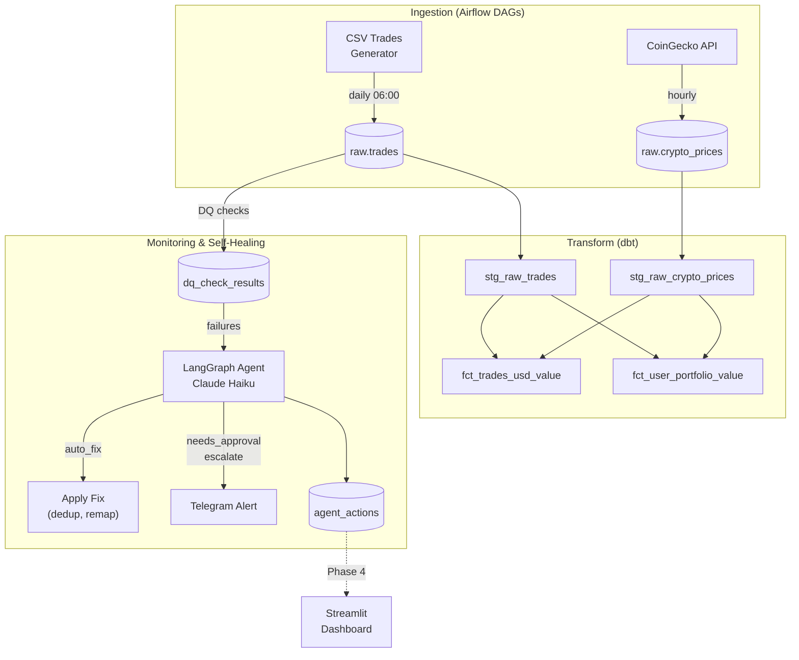
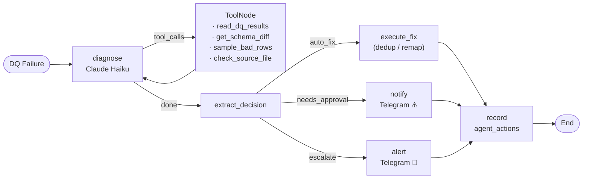
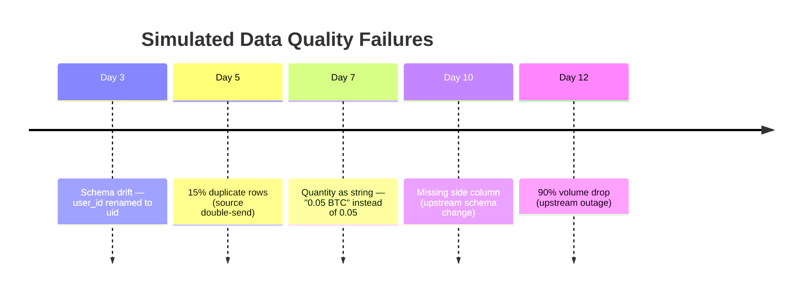

# Self-Healing ETL Pipeline
**Domain**: Crypto Trading Platform Analytics

An end-to-end ETL pipeline that ingests crypto trade data and market prices, transforms them with dbt, and uses a LangGraph AI agent to detect, diagnose, and auto-remediate data quality issues — without human intervention for common failure patterns.

---

## Architecture



---

## Agent Decision Flow



---

## Error Injection Scenarios (Phase 2)



---

## Tech Stack

| Layer         | Tool                    |
|---------------|-------------------------|
| Orchestration | Apache Airflow 2.9      |
| Warehouse     | PostgreSQL 15           |
| Transform     | dbt-core 1.7            |
| Agent         | LangGraph + Claude Haiku|
| Alerting      | Telegram Bot API        |
| Dashboard     | Streamlit *(Phase 4)*   |
| Container     | Docker Compose          |

---

## Quick Start

```bash
# 1. Copy env file and fill in ANTHROPIC_API_KEY (required for agent)
cp .env.example .env

# 2. Build and start all services
docker-compose up --build

# 3. Open UIs
#    Airflow    → http://localhost:8080  (admin / admin)
#    Dashboard  → http://localhost:8501
```

**DAG schedule:**

| DAG | Schedule | Purpose |
|-----|----------|---------|
| `ingest_trades` | 06:00 daily | Generate CSV → load raw.trades → 5 DQ checks |
| `fetch_crypto_prices` | hourly | CoinGecko → raw.crypto_prices |
| `transform_dbt` | 08:00 daily | dbt staging → marts → tests |
| `monitor_agent` | 07:00 daily | Read DQ failures → run self-healing agent |

---

## Database Layout

```
crypto_dw
├── raw
│   ├── trades             — daily CSV ingest (with raw_quantity for type error detection)
│   └── crypto_prices      — hourly CoinGecko prices
├── staging
│   ├── stg_raw_trades     — cleaned, deduplicated view
│   └── stg_raw_crypto_prices
├── marts
│   ├── fct_trades_usd_value      — trade × nearest price (±15 min LATERAL join)
│   └── fct_user_portfolio_value  — net holdings × current price
└── monitoring
    ├── expected_schemas   — schema registry for drift detection
    ├── dq_check_results   — results of 5 automated DQ checks
    └── agent_actions      — full audit trail of every agent decision
```

---

## Roadmap

| Phase | Status | Description |
|-------|--------|-------------|
| 1 | ✅ Done | Airflow + PostgreSQL + dbt pipeline running end-to-end |
| 2 | ✅ Done | Controlled error injection + 5 automated DQ checks |
| 3 | ✅ Done | LangGraph agent with tool suite and decision engine |
| 4 | ✅ Done | Streamlit dashboard showing agent audit trail and DQ history |

---

## Project Structure

```
├── dags/              Airflow DAGs (ingest, prices, transform, monitor)
├── dbt/               dbt project (models, tests, macros)
├── agent/             LangGraph agent (graph, tools, fixes, telegram)
├── dashboard/         Streamlit app (app.py, Dockerfile)
├── docker/airflow/    Custom Airflow Dockerfile + requirements
├── scripts/           DB init script, CSV generator with error injection
└── data/              Generated CSV files (gitignored)
```
